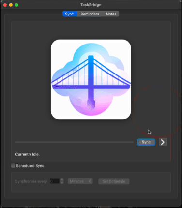
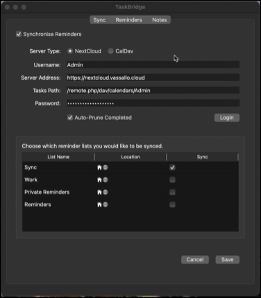
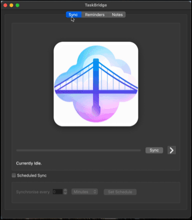

# TaskBridge

Export your Apple Reminders & Notes to NextCloud, a local folder, or CalDav - and keep them in sync!

Apple Notes & Reminders are great apps... as long as you're using them in the Apple ecosystem. If you need access to these 
apps from Windows, Linux or an Android device, you're stuck using web apps. TaskBridge is a small attempt at solving this
problem, by allowing notes and reminders to be synchronised to other cloud services which can more easily be accessed on 
multiple devices. 

    
## Current Sync Support

- Apple Notes can be synchronised with NextCloud Notes, or any other Markdown folder.
- Apple Reminders can be synchronised with NextCloud Tasks, or most CalDAV VTODO calendars.

## Documentation

- For full user documentation, please see [TaskBridge User Documentation](https://docs.taskbridge.app).
- For technical documentation, see [TaskBridge on Read the Docs](https://taskbridge.readthedocs.io).

## Limitations
TaskBridge has several known limitations. Some of these limitations are due to TaskBridge being brand-new software, 
worked on by one guy, in his spare time. However, many limitations come from the closed nature of the Apple ecosystem. 
This is unfortunate, but a reality.

You should therefore be aware of the following limitations:

### Notes
- Only image and URL attachments are supported. This is due to the closed way that other attachment types are handled by Apple Notes, and the fact that NextCloud notes do not support other attachment types.
- Todo items (i.e. items with a checkable box) are not supported, and will be converted to bullets once synchronised. This is due to the closed (and undocumented) way that Apple Notes handles these items.

### Reminders
- Alarms do not have time zone support.
- Although alarms are synchronised to NextCloud, the NextCloud Notes app will not display reminder messages. This is not a TaskBridge limitation.
- Additional notes added to reminders are synchronised, but this does not include attachments.

### Notes & Reminders
- When an item is sychronised from a remote server to the local Notes/Reminders app, the modification date of the local version is set to the date/time when sychronisation occurred. This cannot be changed by TaskBridge. This means that, on the next sync, the item will be re-uploaded to the remote server, even if no further changes have been made locally. However, this does not result in lost data - if more changes are made remotely, the remote note is correctly used as the ‘newer’ note.

## Contributing

TaskBridge is currently a one-man effort! Hopeully, this section will some day be filled with contributor's names! If you 
would like to contribute to TaskBridge, you're in the right place. 

What the project needs most:

1. **Testers**. Being a one-man effort, TaskBridge has been tested on an extremely limited number of configurations. If you
have a Mac, you too can test TaskBridge by just trying it out and [reporting any issues](https://github.com/pint-sized/taskbridge/issues).
2. **Developers**. As with any project in its early days, TaskBridge has bugs. An extra pair of eyes going over the code 
would be a huge help to continue squashing as many of them as possible. 
3. **Designers**. The TaskBridge UI and imagery could use a lot of spit and polish. If you have UI/UX or graphic design skills,
you too can make a valuable contribution.

## Developing
The project is written in Python and uses [Poetry](https://python-poetry.org) for dependency management.
Use any environment you prefer. The project is primarily built using PyCharm on macOS; A `.idea` folder is provided 
if you're using PyCharm, which has various inspection and run configurations already set. You will need to be using macOS 
and logged into iCloud for synchronisation functions to work.

1.  Install [Homebrew](https://brew.sh/).

2. Install Git:
        
        brew install git

3. Clone this repository:

        git clone https://github.com/pint-sized/taskbridge.git

4. Install Poetry:

        pipx install poetry

5. Active the virtual environment:

        cd /path/to/TaskBridge
        poetry shell

6. Install dependencies:

        poetry install

7. Useful commands (especially if you're not using PyCharm):

Run TaskBridge: 

        python taskbridge/gui/TaskBridge.py

Build:

        poetry run poetry build

Update lock file (after changing `pyproject.toml`):

        poetry run poetry lock

Generate App file (alias):

        python setup.py py2app -A

Generate App file (production):

        python setup.py py2app

## FAQ

What are the System Requirements?
: TaskBridge must run on macOS, and you must be logged into iCloud. There's no other way of getting access to your notes and 
reminders otherwise.

How does it work?
: TaskBridge uses various AppleScript scripts to fetch your notes and reminders from the Apple apps. Notes are converted 
from HTML to Markdown, and added to your NextCloud Notes folder (or any other folder of your choice). In the case of NextCloud, 
it's then up to the [NextCloud Desktop](https://nextcloud.com/install/) app to sync these. Reminders are synchronised to NextCloud 
Tasks, or other CalDAV servers, via CalDAV.

Does everything work?
: No. Please see the limitations. The biggest limitation is that certain elements in Apple Notes (such as checkable TODO 
items and attachments other than links or images) are undocumented and unavailable (presumably) via AppleScript.

Do I have to keep my Mac switched on if I use scheduled reminders?
: Yes.

Why does TaskBridge prompt me to prune completed reminders?
: For some reason, the Apple Reminders app is extremely slow to respond when there are many active reminders. For most people, 
the majority of their reminders are in the Completed section. Clearing this out greatly improves performance. Even with just 20-or-so 
completed reminders, Reminder synchronisation takes **considerably** longer.

Can I use TaskBridge without a GUI?
: Yes. A PyPi package is available. Also, see the `taskbridge/notes` and `taskbridge/reminders` folders in the repository.

Why don't you use the NextCloud Notes API?
: The NextCloud Notes API is lacking some core features, such as support for adding attachments to Notes.

Why don't you use CloudKit?
: The information available via CloudKit is limited. Moreover, Apple's EULA specifically forbids accessing CloudKit via an 
application on script.

## Disclaimer

THE SOFTWARE IS PROVIDED “AS IS”, WITHOUT WARRANTY OF ANY KIND, EXPRESS OR IMPLIED, INCLUDING BUT NOT LIMITED TO THE WARRANTIES OF MERCHANTABILITY, FITNESS FOR A PARTICULAR PURPOSE AND NONINFRINGEMENT. IN NO EVENT SHALL THE AUTHORS OR COPYRIGHT HOLDERS BE LIABLE FOR ANY CLAIM, DAMAGES OR OTHER LIABILITY, WHETHER IN AN ACTION OF CONTRACT, TORT OR OTHERWISE, ARISING FROM, OUT OF OR IN CONNECTION WITH THE SOFTWARE OR THE USE OR OTHER DEALINGS IN THE SOFTWARE.

 